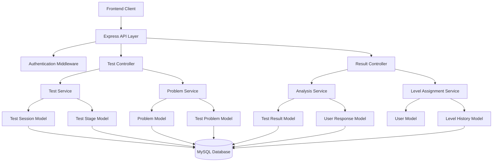

# Design Document

## Overview

The Progressive Testing System is a comprehensive backend solution that evaluates users through multi-stage assessments with adaptive difficulty levels. The system integrates with the existing Express.js/Sequelize architecture to provide intelligent test progression, real-time performance analysis, and automated skill level assignment.

The system follows a microservice-oriented approach within the monolithic structure, with dedicated modules for test management, result analysis, and level assignment. It leverages the existing user authentication and database infrastructure while introducing new models and services specifically for progressive testing.

## Architecture

### High-Level Architecture



### Service Layer Architecture

The system implements a layered architecture with clear separation of concerns:

1. **Controller Layer**: Handles HTTP requests and responses
2. **Service Layer**: Contains business logic and orchestration
3. **Model Layer**: Data access and validation using Sequelize ORM
4. **Utility Layer**: Helper functions for calculations and validations

## Components and Interfaces

### 1. Test Management Components

#### TestController
- **Purpose**: Manages test session lifecycle and problem delivery
- **Key Methods**:
  - `startTest(userId, testType)`: Initiates a new test session
  - `getNextProblem(sessionId)`: Retrieves next problem based on current stage
  - `submitAnswer(sessionId, problemId, answer, responseTime)`: Processes user responses
  - `pauseTest(sessionId)`: Pauses current test session
  - `resumeTest(sessionId)`: Resumes paused test session

#### TestService
- **Purpose**: Core business logic for test progression and stage management
- **Key Methods**:
  - `createTestSession(userId, testConfig)`: Creates new test session with initial stage
  - `progressToNextStage(sessionId, currentPerformance)`: Evaluates stage completion and progression
  - `calculateStageScore(responses)`: Computes performance metrics for current stage
  - `determineNextProblem(sessionId, userPerformance)`: Selects appropriate next problem

#### ProblemService
- **Purpose**: Manages problem selection and difficulty progression
- **Key Methods**:
  - `getProblemsForStage(stageLevel, count)`: Retrieves problems matching stage difficulty
  - `validateProblemDifficulty(problemId, expectedLevel)`: Ensures problem meets difficulty requirements
  - `getAdaptiveProblem(userPerformance, currentStage)`: Selects problems based on user performance

### 2. Analysis Components

#### AnalysisService
- **Purpose**: Comprehensive performance analysis and metric calculation
- **Key Methods**:
  - `analyzeTestSession(sessionId)`: Performs complete session analysis
  - `calculateAccuracyRate(responses)`: Computes accuracy percentage
  - `calculateAverageResponseTime(responses)`: Determines response time metrics
  - `identifyWeakAreas(responses)`: Analyzes incorrect responses for patterns
  - `generatePerformanceReport(sessionId)`: Creates detailed performance summary

#### MetricsCalculator (Utility)
- **Purpose**: Statistical calculations and performance metrics
- **Key Methods**:
  - `calculateWeightedScore(accuracy, speed, consistency)`: Computes composite score
  - `normalizeResponseTimes(times)`: Standardizes timing data
  - `calculateConsistencyScore(responses)`: Measures performance stability
  - `detectOutliers(dataPoints)`: Identifies anomalous responses

### 3. Level Assignment Components

#### LevelService
- **Purpose**: Automated skill level assignment and progression tracking
- **Key Methods**:
  - `assignLevel(userId, testResults)`: Determines appropriate skill level
  - `generateLevelFeedback(level, performance)`: Creates personalized feedback
  - `updateUserLevel(userId, newLevel, reasoning)`: Updates user's skill level
  - `trackLevelHistory(userId, levelChange)`: Records level progression

#### FeedbackGenerator (Utility)
- **Purpose**: Generates personalized feedback and recommendations
- **Key Methods**:
  - `generateLevelExplanation(score, metrics)`: Creates level assignment rationale
  - `suggestImprovementAreas(weakAreas)`: Provides targeted recommendations
  - `createProgressSummary(currentLevel, previousLevel)`: Summarizes advancement

## Data Models

### Core Testing Models

#### TestSession
```javascript
{
  session_id: INTEGER (PK, Auto-increment),
  user_id: INTEGER (FK -> users.user_id),
  test_type: ENUM('placement', 'progress', 'practice'),
  status: ENUM('active', 'paused', 'completed', 'abandoned'),
  current_stage: INTEGER,
  total_stages: INTEGER,
  start_time: DATETIME,
  end_time: DATETIME,
  pause_duration: INTEGER, // Total pause time in seconds
  session_config: JSON, // Test configuration and parameters
  created_at: DATETIME,
  updated_at: DATETIME
}
```

#### TestStage
```javascript
{
  stage_id: INTEGER (PK, Auto-increment),
  session_id: INTEGER (FK -> test_sessions.session_id),
  stage_number: INTEGER,
  difficulty_level: ENUM('beginner', 'easy', 'medium', 'hard', 'expert'),
  problems_count: INTEGER,
  completed_problems: INTEGER,
  stage_score: DECIMAL(5,2),
  start_time: DATETIME,
  end_time: DATETIME,
  status: ENUM('pending', 'active', 'completed'),
  created_at: DATETIME,
  updated_at: DATETIME
}
```

#### UserResponse
```javascript
{
  response_id: INTEGER (PK, Auto-increment),
  session_id: INTEGER (FK -> test_sessions.session_id),
  problem_id: INTEGER (FK -> problems.problem_id),
  stage_id: INTEGER (FK -> test_stages.stage_id),
  user_answer: TEXT,
  correct_answer: TEXT,
  is_correct: BOOLEAN,
  response_time: INTEGER, // Response time in milliseconds
  attempt_count: INTEGER,
  hints_used: INTEGER,
  submitted_at: DATETIME,
  created_at: DATETIME
}
```

#### TestResult
```javascript
{
  result_id: INTEGER (PK, Auto-increment),
  session_id: INTEGER (FK -> test_sessions.session_id),
  user_id: INTEGER (FK -> users.user_id),
  overall_score: DECIMAL(5,2),
  accuracy_rate: DECIMAL(5,2),
  average_response_time: INTEGER,
  consistency_score: DECIMAL(5,2),
  assigned_level: ENUM('beginner', 'intermediate', 'advanced'),
  previous_level: ENUM('beginner', 'intermediate', 'advanced'),
  level_change: ENUM('promoted', 'maintained', 'demoted'),
  feedback_text: TEXT,
  improvement_areas: JSON,
  strengths: JSON,
  created_at: DATETIME
}
```

#### LevelHistory
```javascript
{
  history_id: INTEGER (PK, Auto-increment),
  user_id: INTEGER (FK -> users.user_id),
  previous_level: ENUM('beginner', 'intermediate', 'advanced'),
  new_level: ENUM('beginner', 'intermediate', 'advanced'),
  test_session_id: INTEGER (FK -> test_sessions.session_id),
  change_reason: TEXT,
  performance_metrics: JSON,
  created_at: DATETIME
}
```

### Extended Problem Model

The existing Problem model will be extended with additional fields for progressive testing:

```javascript
// Additional fields for existing Problem model
{
  stage_suitability: JSON, // Which stages this problem is suitable for
  adaptive_difficulty: DECIMAL(3,2), // Fine-grained difficulty (1.0-5.0)
  prerequisite_concepts: JSON, // Required knowledge areas
  learning_objectives: JSON, // What this problem teaches/tests
  estimated_solve_time: INTEGER, // Expected solve time in seconds
  success_rate: DECIMAL(5,2), // Historical success rate
  discrimination_index: DECIMAL(3,2) // How well it differentiates skill levels
}
```

## Error Handling

### Error Categories and Responses

#### 1. Validation Errors (400 Bad Request)
```javascript
{
  error: "VALIDATION_ERROR",
  message: "Invalid input parameters",
  details: {
    field: "session_id",
    issue: "Session ID must be a positive integer"
  }
}
```

#### 2. Authentication Errors (401 Unauthorized)
```javascript
{
  error: "AUTHENTICATION_ERROR",
  message: "User not authenticated",
  details: {
    required_action: "login"
  }
}
```

#### 3. Resource Not Found (404 Not Found)
```javascript
{
  error: "RESOURCE_NOT_FOUND",
  message: "Test session not found",
  details: {
    resource_type: "test_session",
    resource_id: "12345"
  }
}
```

#### 4. Business Logic Errors (422 Unprocessable Entity)
```javascript
{
  error: "BUSINESS_LOGIC_ERROR",
  message: "Cannot submit answer for completed test",
  details: {
    current_status: "completed",
    allowed_statuses: ["active", "paused"]
  }
}
```

#### 5. System Errors (500 Internal Server Error)
```javascript
{
  error: "SYSTEM_ERROR",
  message: "Database operation failed",
  details: {
    operation: "save_test_result",
    retry_possible: true
  }
}
```

### Error Handling Strategy

1. **Input Validation**: Use express-validator for request validation
2. **Database Errors**: Implement retry logic with exponential backoff
3. **Session Recovery**: Preserve test progress during system failures
4. **Graceful Degradation**: Continue operation with reduced functionality when possible
5. **Comprehensive Logging**: Log all errors with context for debugging

## Testing Strategy

### 1. Unit Testing
- **Test Coverage**: Minimum 80% code coverage for all service methods
- **Mock Strategy**: Mock database operations and external dependencies
- **Test Categories**:
  - Service method logic validation
  - Calculation accuracy verification
  - Error handling scenarios
  - Edge case handling

### 2. Integration Testing
- **Database Integration**: Test actual database operations with test database
- **API Endpoint Testing**: Validate complete request-response cycles
- **Service Integration**: Test interaction between different services
- **Authentication Flow**: Verify user authentication and authorization

### 3. Performance Testing
- **Load Testing**: Simulate concurrent test sessions
- **Response Time**: Ensure API responses under 200ms for standard operations
- **Database Performance**: Optimize queries for large datasets
- **Memory Usage**: Monitor memory consumption during extended test sessions

### 4. End-to-End Testing
- **Complete Test Flow**: Simulate full user test journey
- **Level Assignment Accuracy**: Verify correct level assignments
- **Data Persistence**: Ensure all test data is properly saved
- **Recovery Testing**: Test system recovery after failures

### Test Data Management
- **Seed Data**: Predefined problems for each difficulty level
- **Test Users**: Dedicated test accounts with known skill levels
- **Performance Baselines**: Expected response times and accuracy rates
- **Cleanup Procedures**: Automated test data cleanup after test runs